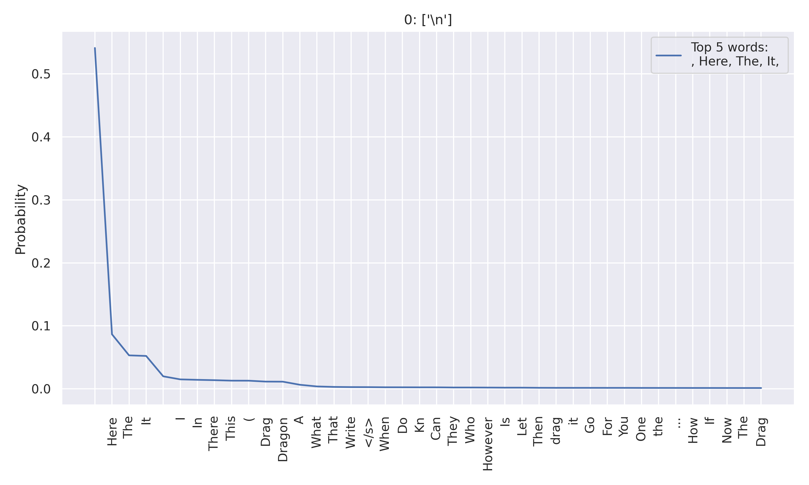
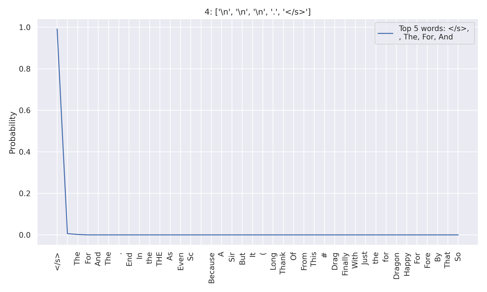

# Introduction

The AI revolution taking place in the last half decade has been headlined by Large Language Models (LLMs). These transformer models have demonstrated proficiency in a variety of tasks across all fields, and many are adopting LLMs into their regular workflow. Such examples include extended literature reviews, research papers and reports, and even the recent GPT-o1 model, which requires long output for its chain-of-thought reasoning.

The unique ability of these models to quickly follow and execute instructions makes it an important and effective tool. However, with rising demand comes rising expectations of model abilities.

In the last couple of years alone, there have been drastic improvements in LLMs including context capacity, speed, and logical reasoning. One of the most notable is the ability to input long contexts to models beyond the pretraining sequence length.

But what about the *ability to produce long outputs*? We’ve improved language models with the freedom to listen and understand, but we have yet to *provide them the ability to respond with outputs with equal and/or longer lengths*.

We define a large language model’s ability to respond to a prompt as **perpetuity**. In technical terms, perpetuity is the ability of a model to continue generating new tokens. The current token generation process is sometimes misleading by the nonsensical nature of “\n \n \n” data. We found this led to the generation of a halt EOS token, which stops output generation. 

To combat decreasing entropy leading to the generation of the EOS token, we propose a new method: **Perpetual Text Generation using Dynamic Temperature Adjustment**. By dynamically increasing temperature, we provide the model with an opportunity to produce alternative continuations – therefore prolonging output. 

# When do Models Stop Generating New Tokens?

In transformer-based language models, particularly decoder-only architectures used for text generation, the process of generating tokens continues sequentially until a stopping criterion is met. 

There are a couple of ways that a model can do this:
### Setting a max_token parameter
By setting a maximum number of tokens, you can override the model's default tendencies and encourage it to produce longer outputs. However, simply increasing the token limit doesn't guarantee that the model will generate more extended content, as it may still generate the EOS token prematurely due to its learned patterns.

### Hitting a stopping criterion EOS token
- If no max_token parameter is set, then the model continues generating tokens until it outputs the EOS token, indicating that it should stop.
- Training with EOS Tokens: During training, models are exposed to sequences that conclude with a special end-of-sequence token, often denoted as $\lt$EOS$\gt$ <d-cite key="touvron2023llama2openfoundation"></d-cite> or <|eot_id|> <d-cite key="dubey2024llama3herdmodels"></d-cite>. This token signifies the completion of a coherent piece of text.
- Learned Termination Behavior: Through exposure to these tokens, the model learns to predict an EOS token when it determines that a logical conclusion has been reached in the context of the generated text.

### Probability Distribution and Sampling Methods:
- Next Token Prediction: At each generation step, the model computes a probability distribution over the vocabulary for the next token, conditioned on all previously generated tokens.
- Likelihood of EOS Token: The probability assigned to the EOS token depends on the context. If the model assesses that the generated content forms a complete thought or sentence, it increases the probability of selecting EOS.
- Sampling Strategies: The choice of sampling method (e.g., greedy search, beam search, top-k sampling, nucleus sampling) can affect when the EOS token is selected. Some methods may favor high-probability tokens, potentially leading to earlier termination.

When no explicit maximum token limit is set, the stopping point relies heavily on the model's ability to predict when a piece of text should logically end. As previous work (Xiong et al., 2024; Fu et al., 2024) has shown models often “cap” their output lengths based on the upper limits present in their SFT datasets, even if they were exposed to longer sequences during pre-training. The model's training data plays a crucial role here; if it includes diverse examples of text lengths and proper use of EOS tokens in the retraining process, the model is better equipped to determine appropriate stopping points.

# Motivating Experiments
To further explore how these factors influence the model's stopping behavior, we conducted a series of experiments to identify trends that may be causing the convergence to the EOS token. 

Our first experiment examines the variance and uncertainty in the “blocks” leading up to the EOS token generation. Since the probability of a token can exhibit significant variance, a block-wise trend is analyzed instead of a token-wise trend. A block is defined as a group of consecutive tokens within a sequence. The average probability of a specific token within each block is then calculated to represent its probability in that block. 

Our second experiment examines the tokens leading up to the EOS token. 

### Block-Wise Analysis
Observation: All four metrics show an increasing probability of EOS token, decreasing information content, decreasing entropy, and decreasing varentropy. 

<!-- 

  
   
  Figure 1: Block-Wise Analysis

 -->



  
As observed, the average probability of the EOS token appearing per block spikes during the 8th block. This indicates that the model increasingly believes its current output sequence should end soon. Consequently, we see a decrease in the average information content of the EOS token per block.

We can define information content as $I(x) = -log_{2}P(x)$
where $I(x)$ represents the information content of a token $x$ in a sequence, and $P(x)$ is the probability of $x$ occuring. A decrease in information content corresponds to an increase in the probability of the EOS token, reflecting the model's growing confidence in concluding the sequence.

Entropy measures the uncertainty or randomness in the probability distribution of generated tokens. A decreasing entropy indicates that the uncertainty is reducing, with the model's predictions narrowing to a smaller set of higher-probability tokens. This leads to less variability in the generated tokens.

Varentropy, on the other hand, refers to the variance of entropy over time, capturing fluctuations in uncertainty. A decreasing varentropy implies that the token distributions are stabilizing, signaling more consistent predictions from the model as it approaches the end of the sequence.

From this experiment, we observe that there is a factor within the blocks causing a convergence towards the EOS token. Not only are the information content, entropy, and varentropy values decreasing, but the probability of the EOS token is also increasing. 

### Token-Wise Analysis
Observation: Competition between the EOS token and the new line token (\n)

<!-- 

  
   
  Figure 2: Token-Wise Analysis, 0

 -->



  

Another observation we had was that the EOS and (\n) tokens were competing against each other in the final token generations.
In figure 2, we can see that based on the previous context of the new line token (\n), the highest probable token is *again*, the new line token. 

<!-- 

  
   
  Figure 3: Token-Wise Analysis, 4

 -->



  
In figure 3, we can see that the new line token was predicted 3 times before the EOS token took over for highest probability (with a period inbetween). Since the model is deciding between \n or EOS, we can say that the *previous tokens are getting less effective to the next predictions*. This means that the model is not able to provide more consistent context related to the previous tokens, and therefore wants to “halt” or go to new context. 

# Proposed Methods
From our motivating experiments, we observed decreasing entropy and increasing EOS token probability in the blocks leading up to halted output. We also observed certain token combinations that may heavily increase the chance of EOS token generation. This led us to try a few different methods to prolong the output of our model, with each method improving upon the fallacies of the previous:

## Method 1: [EOS Token Suppression](https://github.com/Perpetual-text/icrl25-blog-code/blob/main/generation.py#L14)
As the name suggests, our first method involved suppressing the EOS token. Normally, autoregressive transformers select the next token based off of the conditional probability given the previous tokens in the sequence. With this in mind, we used a sampling without replacement strategy to select the top 2 candidate tokens from the probability distribution. 

Interestingly enough, despite the physical suppression of the EOS token, the model tended to generate tokens that are semantically similar to the EOS token, such as “The End” or “Conclusion.” 



This indicated that even though the model couldn’t physically end the output generation, it was semantically ending output by generating concluding phrases when the EOS token was unavailable. From this experiment we learned that the suppression of the EOS token alone may not be sufficient to prevent premature termination, and we need to guide the model towards producing more extended and coherent continuations. 

## Method 2: [Modified Sampling Post-EOS Token](https://github.com/Perpetual-text/icrl25-blog-code/blob/main/generation.py#L79)
With the goal of creating a more stochastic sampling approach, we tried increasing the sampling temperature, and using techniques like top-k and nucleus sampling with higher thresholds. Although this allowed the model to continue generating tokens, the generated tokens after the “evicted” EOS token may diverge drastically from the previous context, which can result in incoherent or contextually irrelevant continuations.



Although a bit out of character, this is an example of a contextually irrelevant continuation. In the next methods, we attempt to resolve this issue.

## Method 3: [Regenerating Tokens Prior to the EOS Token](https://github.com/Perpetual-text/icrl25-blog-code/blob/main/generation.py#L150)
Our 3rd method involves regenerating a portion of the sequence preceding the EOS token. This approach reintroduces part of the prior context, enabling the model to calibrate its understanding of the prompt and produce alternative continuations to align better with the original narrative output. 

We achieve this using: 1) a backstep hyperparameter, which determines the number of tokens to remove from the end of the generated sequence when the EOS token is predicted and 2) a KV-cache adjustment to reflect the truncated sequence. From here, the model resumes token generation from the truncated state, attempting to generate a different continuation without the influence of the previously predicted EOS token. 

This method did help avoid premature endings by allowing the model to explore alternative continuations. However, the loss of context by deleting the generated tokens still impacted the coherence and relevance of the generated text. 

## Method 4: [Regenerating and Resampling Tokens Prior to the EOS token with Dynamic Temperature Adjustment](https://github.com/Perpetual-text/icrl25-blog-code/blob/main/generation.py#L239)
From our “Block-wise Analysis” section, we observe that entropy, varentropy, and information content all decrease in the block where the EOS token is generated. With this assumption that the model is converging towards generating the EOS token, we know that we need some way of introducing more randomness into the model. A way to achieve this is by increasing the temperature.

In this attempt we kept the backstep parameter and the KV-cache adjustment, but incorporated a *dynamic temperature adjustment* during the token regeneration. 

The generation resumes initially with a doubled sampling temperature to promote diversity in the immediate next token. This temperature is then gradually decreased using a scheduling function, aiming to return back to the original temperature at the point where the original EOS token was predicted. The model continues to generate tokens in this fashion until the output is complete.

{INSERT CODE BLOCK SHOWING TEMPERATURE INCREASE HERE}

The initial high temperature encourages the model to explore a wider range of possible continuations, reducing the likelihood of repeating the same ending. 

{INSERT CODE BLOCK SHOWING gradual temperature decrease hERE}

Gradually decreasing the temperature helps the model focus its prediction while slowly toning down on stochasticity. This helps *enhance the coherence of the generated text while maintaining a bit of randomness*.

The results of this method were by far the best out of our approaches. We were able to obtain 1,000 more generated tokens, and observed longer sequences with more contextually appropriate continuations compared to the previous methods. 
You can compare the results here {insert link to generated responses}. 

# Conclusion and Looking Ahead
Our experiments and analysis of EOS token generation highlight a few challenges and potential solutions in managing output length in large language models. Perpetual output is only useful for humans if it is *coherent and an actual extension of the original context*. Our first three methods showed that simply asking the transformer model to “try again” is not enough – we need to backtrack and introduce stochasticity to allow the model to think creatively on how to coherently extend output. 

Regenerating tokens prior to the EOS token showed promising results with a 1,000 token increase while balancing diversity and focus in the model’s predictions. Our results suggest that adaptive manipulation of the token generation process and sampling strategies can enhance the quality of generated text. 

We believe that further research into optimizing the scheduling function can be beneficial in prolonging output. Additional strategies to extend token generation earlier in the output can also be very beneficial towards having a longer output while maintaining focus, direction, and coherence. Currently our strategy only extends output in the latter areas of the original model response. Ideally, the model should be able to determine how long the ideal output should be, and generate output accordingly. 

